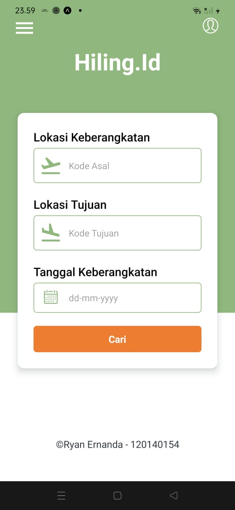

# HILING.ID Ryan Ernanda - 120140154

Download apk hiling <a href="#">di sini</a>.

## Screenshoots

<details>
<summary>Halaman Pencarian</summary>



</details>

<details>
<summary>Halaman Hasil Pencarian</summary>


</details>

Menambahkan halaman profile untuk implementasi redux thunk sebagai pengambilan IP user menggunakan API, <br/>
halaman profile dapat memencet logo atau icon profile pada halaman home atau halaman hasil pencarian.

<details>
<summary>Halaman Profile</summary>


</details>

<details>
<summary>Screenshot Test Unit Jest</summary>


</details>

## Library

- React Native
- Expo
- React Native Vector Icons
- Redux Thunk
- Jest
- Redux Mock Store

## Sturktur Folder

```
/
├─ assets/                  # Semua data gambar
├─ src/
├─ └─ db/
│      └─ Data.js           # File data untuk menyimpan data penerbangan
│      └─ logo.js           # File logo untuk load gambar
├─ └─ redux-thunk/
│      └─ Actions.js        # File Action Fetch Redux Thunk
│      └─ Actions.test.js   # File Jest Testing Unit Action Fetch Redux Thunk
│      └─ Reducer.js        # File Reducer untuk mengatur state berdasarkan Action
│      └─ store.js          # File Middleware Redux Thunk
│  └─ Detail.js             # File detail untuk menampilkan hasil pencarian
│  └─ Home.js               # File home untuk menampilkan form pencarian
│
├─ App.js           # file utama untuk merender semua file
├─ .gitattributes
├─ .gitignore
├─ README.md
├─ app.json
├─ babel.config.json
├─ eas.json
├─ package-lock.json
├─ package.json
```

## Cara menjalankan

- Clone Repository ini
- Install React dan Expo
- Masuk Kedalam directory utama dan jalankan

```
npm install
```

atau

```
npm install -f
```

- jika ingin menjalankan testing unit jest gunakan

```
npm test
```

- tunggu hingga proses selesai
- jika ingin di jalankan dengan android maka gunakan syntax berikut

```
npm run android
```

- jika ingin di jalankan dengan website maka gunakan syntax berikut dan ikuti perintahnya karena ada library tambahan yang harus di install

```
npm run web
```
